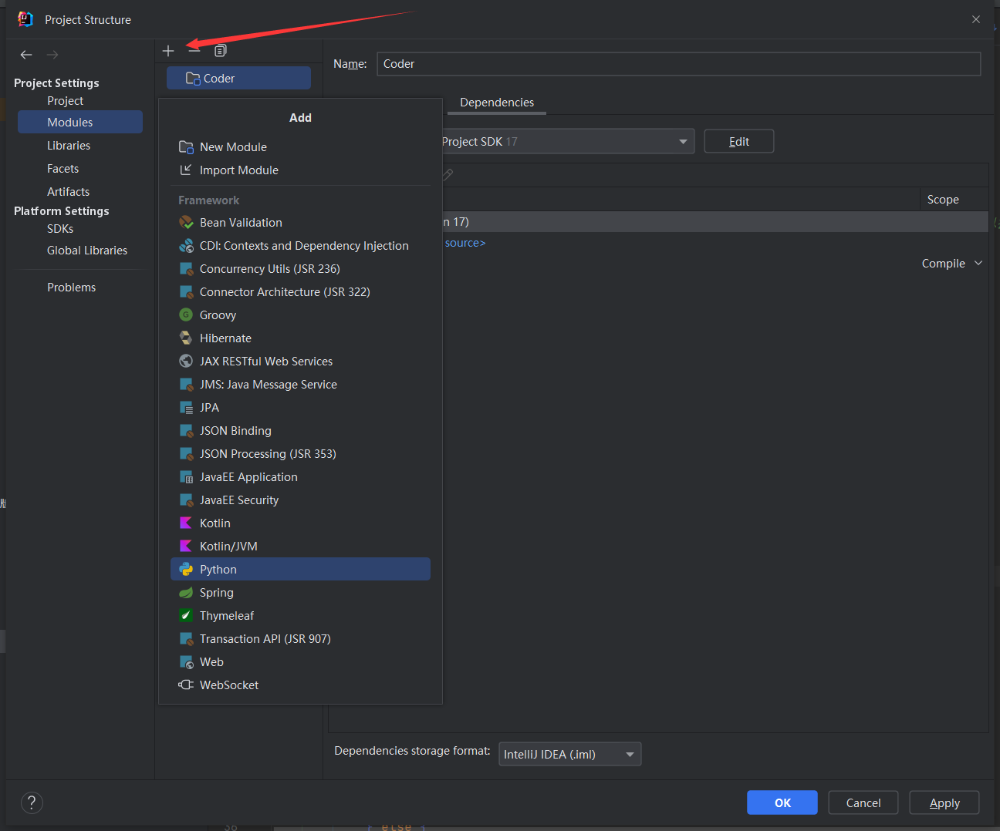

# 算法刷题记录

刷算法题的代码，主要为LeetCode

## 环境配置

1. 运行环境

   这里我是用idea写的代码，项目中用到的主要是`Java 17`，但是周赛是使用`Python 3.6.8`写的

   - Java代码使用了JUnit 5.*执行测试用例，需要引入对应的依赖

   - 在Java项目中运行Python代码需要安装[Python插件](https://plugins.jetbrains.com/plugin/631-python)，然后File → Project Structure

     - 添加Python SDK

       

     - 添加Python解释器

       

     - 添加Python依赖

       

## 部分package含义

+ leetcode： 力扣刷题记录
  - SoByNumber：按照序号刷题记录，每个类名字So后边的数字是题的序号
  - So**：每日一题，包名字So后边的数字表示月份，具体到类名字后边的是日期
  - 二叉树、动态规划、...：跟着[代码随想录](https://www.programmercarl.com/)按照类别刷题
  - 周赛：单周赛和双周赛的题目，是用Python写的，这部分还没同步过来
+ newcoder: 牛客网刷题记录
+ pat：准备复试时刷的PAT试题

## 一些算法总结
- [递归加回溯](./src/leetcode/So05/So0508.java)
  
  使用递归在每次操作后调用自身，以此记录每次的状态，然后在递归中判断当前状态是否可行，可行就直接返回，不可行返回递归上一层继续执行

